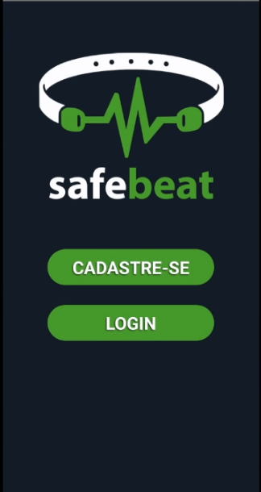
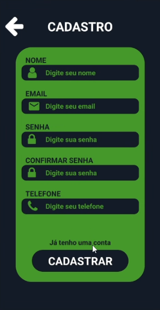
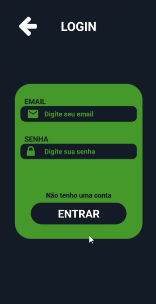
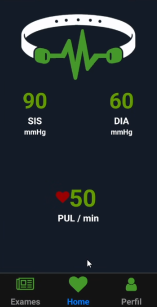
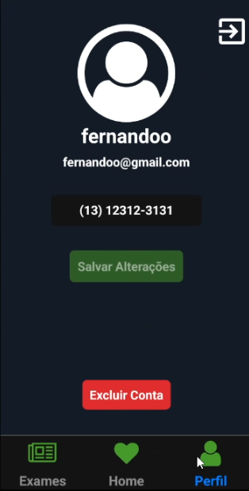

<div align="center">
    
</div>
<p align='center'>
   O SafeBeat é um sistema inovador que utiliza IA e IoT para monitorar a saúde cardíaca dos pacientes. Através de uma pulseira, coletamos dados de frequência cardíaca em tempo real, permitindo a detecção precoce de possíveis infartos. Os dados são analisados e            compartilhados com Protetores e Guardiões, que podem ser parentes ou profissionais de saúde. Além disso, contatos de emergência são notificados em caso de incidentes. A precisão da IA é aprimorada através de exames regulares e informações do paciente. Juntos,           estamos criando um futuro mais seguro para a saúde do coração.

</p>

### Sumário
1. [URLs relevantes](#URLs-relevantes)
2. [Ambiente de desenvolvimento](#Ambiente-de-desenvolvimento)
3. [Troubleshooting](#Troubleshooting)
4. [Instalação do projeto](#Instalacao-do-projeto)
5. [Iniciar aplicativo](#Iniciar-aplicativo)
6. [Instruções de uso](#Instruções-de-uso)
7. [Testes e limitações](#Testes-e-limitacoes)
8. [Agradecimentos](#Agradecimentos)

## URLs relevantes
- *[Video PITCH SafeBeat](https://www.youtube.com/watch?v=FmfozoqE9Yc)*
- *[API de comunicação](https://github.com/SafeBeat-Global/java-api)*
- *[React Native - Environment Setup](https://reactnative.dev/docs/environment-setup)*
- *[Troubleshooting](https://reactnative.dev/docs/troubleshooting)*

## Ambiente de desenvolvimento

>**OBSERVAÇÃO**: Veja a documentação oficial *[React Native - Environment Setup](https://reactnative.dev/docs/environment-setup)* para definir e configurar corretamente o seu ambiente de desenvolvimento.

## Troubleshooting

Caso lhe ocorra algum problema na configuração do seu ambiente, veja nessa página *[Troubleshooting](https://reactnative.dev/docs/troubleshooting)*.

## Instalação do projeto

Após configurar o seu ambiente de desenvolvimento para rodar o react-native, instale o projeto pelo meio convencional ou por algum terminal. Primeiramente se direcione ao local desejado e rode o seguinte comando:
```
git clone https://github.com/SafeBeat-Global/safebeat-front
```
Feito isso, abra o seu editor, recomenda-se o *[Visual Studio Code](https://code.visualstudio.com/Download)*, e selecione o projeto front-end do SafeBeat. Ao abrir, navegue até a pasta `/src/services/ApiService.js` e edite o campo "seu-ip" `const ip = 'seu-ip';` para o seu ip da máquina. Para verificar o seu ip, acesse um terminal ou, se estiver no Windows, o CMD.
Nele digite o código:
```
ipconfig
```
Copie e cole o seu IPV4 e substitua no campo mencionado acima. **Não esqueça de salvar as mudanças!**

Abra o seu emulador mobile Android Studio (preferencialmente) e um terminal no diretório do projeto já baixado e rode os seguintes comandos:
```
npm install
```
Esse comando vai instalar todas as dependências usadas no projeto

## Iniciar o aplicativo

Depois de esperar a instalação dos node_modules, digite, ainda no terminal a fim de iniciar o projeto no seu emulador android:
```
npx react-native start
```
Logo em seguida, mostrará na tela as seguintes opções:
```
r - reload the app
d - open developer menu
i - run on IOS
a - run on Android
```
Aperte a tecla "a" para abrir no Android.
**Pronto**, a sua aplicação agora está aberta. Para conseguir usar em totalidade o aplicativo, precisará baixar a *[API de comunicação](https://github.com/SafeBeat-Global/java-api)*, lá terá o passo a passo de como usá-la.

## Instruções de uso

O aplicativo é bem intuitivo e simples, facilitando o seu uso para o dia a dia.
Basta fazer o cadastro e logar que já terá as informações da saúde do seu coração em mãos e assegurada por outros também.

<div align="center">
   
</div>
<div align="center">
   
   
</div>
<div align="center">
   
   
   
</div>

## Testes e limitações

O aplicativo está na versão Open Beta 1.0.0 como uma versão protótipo para testes e uso disciplinar.
Bugs ou erros podem ser encontrados ao manipular dados de requisições advindas da API, bem como outros
eventuais problemas que podem ser observados ao usar a aplicação.


## Agradecimentos

Agradecemos aos desenvolvedores que dedicaram seu tempo e habilidades para aprimorar o código-fonte e a funcionalidade do aplicativo. Suas contribuições são inestimáveis e moldaram positivamente a experiência do usuário.

Além disso, extendemos nossa gratidão àqueles que colaboraram na criação e melhoria da documentação. A clareza e a acessibilidade da informação são fundamentais, e sua ajuda nesse aspecto não passa despercebida.

Agradecemos também à comunidade de código aberto, cujas ferramentas e frameworks foram essenciais para o desenvolvimento suave e eficiente da SafeBeat. Ao compartilhar recursos e conhecimentos, todos contribuímos para o avanço coletivo da tecnologia. Muito obrigado.
